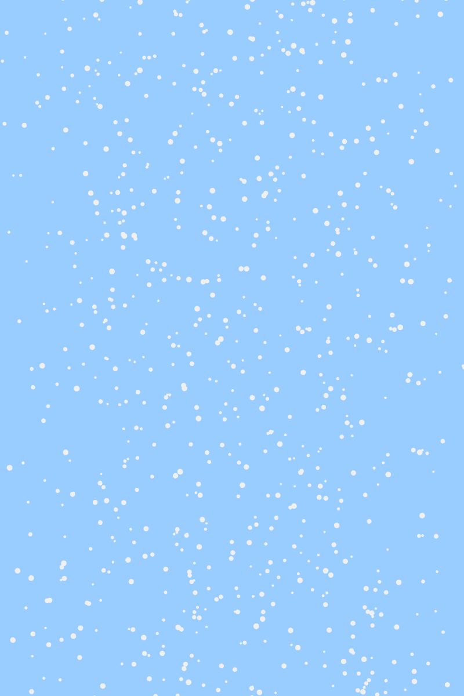

# Creative Coding Final Project – Individual Component  
**Artwork:** *Apple Tree* by Anwar Jalal Shemza  
**Season Theme:** Winter  
**Method:** Perlin Noise and Randomness  
**Name:** Zixuan Lu  
**Unikey:** zilu0601  
**SID:** 540692130  

---

## Interaction Instructions
Open the file, then the animation will start automatically. You do not need to click or move your mouse. You may resize the window to see partial responsiveness.

---

##  My Individual Approach to Animating the Group Code
After group discussions, we decided each member would animate a different season — spring, summer, autumn, or winter.

I chose to represent **winter** and used **Perlin noise** and **randomness** as the core animation methods.

- **Why these methods?**  
  Snowfall is a signature element of winter, and apple trees grow in regions where snowfall is common.  
  - Perlin noise creates smooth, organic motion ideal for falling snow and twinkling stars.  
  - The `random()` function adds unpredictability, capturing nature’s subtle variability.

To reflect winter’s poetic stillness, I animated:
- a quiet **night sky** with flickering stars  
- **glowing fruits** on the apple tree that slowly freeze and fade away  
Together, they show nature’s slow transition from vitality to dormancy.

---

## What Properties Are Animated & How It's Unique
I focused on **visual transformation** and **internal changes**. My work is different from others who used **audio**, **time-based**, or **click-based** interactions.

### Animated Properties:
- **Color**: Fruits shift from warm to icy tones using `lerp()` (symbolizing freezing).
- **Opacity**: Controlled by `noise()` for glowing, breathing-like flicker.
- **Size**: Slight pulsing created with `noise()` for lifelike motion.
- **Disappearance**: After freezing, fruits randomly fade away (`random()` function).

---

##  References and Inspiration

To evaluate feasibility, I searched the p5.js community after imagining a poetic snowy scene.

- **Snowfall Sketch by TheCurlyPasta**  
  [Link](https://editor.p5js.org/TheCurlyPasta/sketches/HkbMtLNJV)  
  Helped me simulate snowflakes using `random()` and vertical movement logic.

  

- **Starry Night Sketch by JD**  
  [Link](https://editor.p5js.org/jd/sketches/HkF70H2uX)  
  Inspired the way I used `noise()` for smooth star flickering.

  

These examples confirmed the visual and technical viability of my ideas.

---

## Technical Overview

### Classes Created
- `Snowflake`: Controls vertical falling + Perlin noise-based wind sway.
- `GlowingFruit`: Controls freezing progression, glowing, color shift, and disappearance.

###  Core Techniques Used
- `noise()` – flickering effect, smooth randomness
- `random()` – unexpected fade-out
- `lerp()` – smooth color transitions
- `map()` – remapping Perlin values to size/brightness ranges

A Perlin-noise-based wind system was also applied to animate snowflakes' horizontal drift.

---

##  External Techniques or Sources

While most tools were from class, I studied a few extras to better realize my vision:

- **`map()` and `lerp()`**
  - Learned from *The Coding Train* YouTube tutorials and p5.js examples.
  - `map()` remaps noise values (0–1) to control glow or size.
  - `lerp()` creates soft transitions between colors.

- **Perlin Noise & Randomness**  
  Deepened understanding via *Nature of Code* YouTube series 
  [YouTube Playlist](https://www.youtube.com/playlist?list=PLRqwX-V7Uu6bgPNQAdxQZpJuJCjeOr7VD)

These additions allowed me to craft animations that feel natural and dynamic.

---

## Changes Made to Group Code
- I **only changed the background** to better suit the winter night theme.
- All elements (snowflakes, stars, fruits) were added as **separate animation layers**.
- Code is fully **modular** using cleanly separated custom classes.

---

##  Use of AI Assistance

To support my development process, I used **ChatGPT** as a problem-solving assistant:

- Debugging hard-to-find animation issues
- Clarifying `lerp()`, `map()`, and Perlin noise usage
- Improving code readability and annotation

All core logic and creative work are my own — AI was used for clarification, troubleshooting, and iteration.

---

